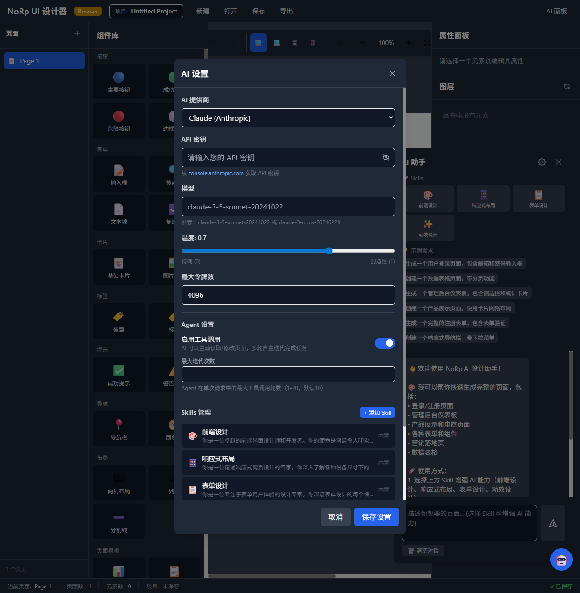
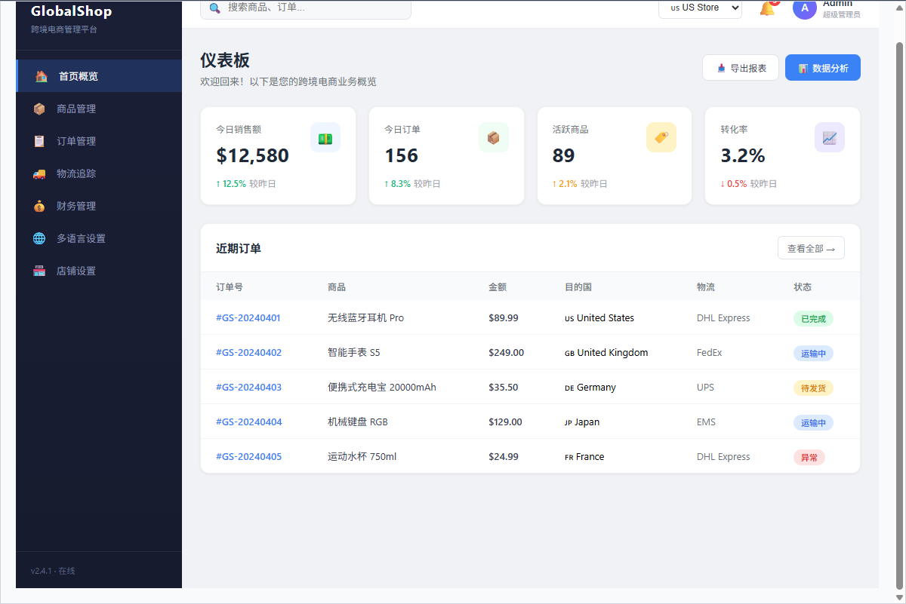
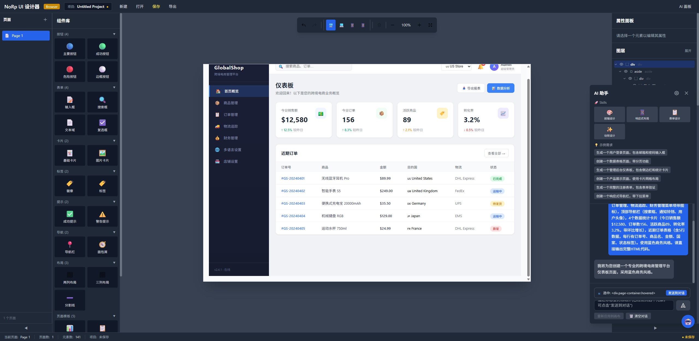

<div align="center">

# NoRp UI Designer

**用自然语言对话，让 AI 为你设计界面**

[](https://opensource.org/licenses/MIT)
[](https://www.electronjs.org/)
[](https://vuejs.org/)
[](https://www.typescriptlang.org/)

[English](#features) | 简体中文

</div>

---

NoRp UI Designer 是一款 AI 驱动的桌面端 UI 设计工具。通过自然语言对话，你可以快速生成完整的网页界面，并在可视化编辑器中精细调整每一个细节。无需编写代码，只需描述你想要的设计。

## ✨ 核心特性

### 🤖 AI 智能设计

| 能力 | 说明 |
|:---|:---|
| **自然语言生成** | 用对话的方式描述需求，AI 实时生成完整的 HTML/CSS 界面 |
| **多模型支持** | 支持 Claude、OpenAI、本地模型（Ollama / LM Studio）等主流 AI 服务 |
| **AI Agent 工具调用** | AI 可以直接操作画布——插入组件、修改样式、调整布局，所见即所得 |
| **快速模板** | 内置登录页、仪表盘、商品列表、表单、落地页、设置页等 6 种常用模板 |
| **流式响应** | 实时流式输出，边生成边预览，无需等待 |

### 🎨 可视化编辑

| 能力 | 说明 |
|:---|:---|
| **拖拽组件** | 左侧组件面板提供按钮、表单、导航、数据展示等预制组件，拖入画布即可使用 |
| **属性编辑** | 选中元素后在右侧面板精确调整样式、尺寸、间距等属性 |
| **图层树** | 清晰展示页面元素层级关系，支持快速定位和可见性切换 |
| **设备预览** | 一键切换桌面 / 平板 / 手机视图，响应式设计实时预览 |
| **撤销/重做** | 完整的操作历史栈，支持无限撤销和重做 |

### 📦 项目管理

- **多页面项目** —— 单个项目支持多个独立页面，自由切换
- **项目文件** —— 保存为 `.norp` 文件，随时打开继续编辑
- **导出** —— 支持导出为 HTML（内联样式 / 分离样式）、Vue、React 组件
- **自动保存** —— 编辑过程自动保存，不丢失任何工作

## 📸 截图预览

<table>
  <tr>
    <td align="center"><b>AI 对话生成界面</b></td>
    <td align="center"><b>可视化画布编辑</b></td>
  </tr>
  <tr>
    <td></td>
    <td></td>
  </tr>
  <tr>
    <td align="center" colspan="2"><b>生成的电商仪表盘示例</b></td>
  </tr>
  <tr>
    <td align="center" colspan="2"></td>
  </tr>
</table>

## 🛠️ 技术栈

| 类别 | 技术 |
|:---|:---|
| 桌面框架 |  |
| 前端框架 |  +  |
| 构建工具 |  |
| 状态管理 | Pinia |
| UI 组件库 | Element Plus |
| 样式方案 | TailwindCSS |
| 代码编辑器 | Monaco Editor |
| AI SDK | @anthropic-ai/sdk, openai |
| 测试框架 | Playwright |

## 🚀 快速开始

### 环境要求

- **Node.js** 18+
- **npm** / yarn / pnpm

### 安装

```bash
git clone https://github.com/your-username/noRp.git
cd noRp
npm install
```

### 开发模式

```bash
# 推荐：启动 Electron 桌面应用（含 Vite 热更新）
npm run electron:dev

# 或仅启动 Web 开发服务器
npm run dev
```

### 打包发布

```bash
npm run electron:build        # 全平台
npm run electron:build:win    # Windows（.exe 安装包）
npm run electron:build:mac    # macOS（.dmg）
npm run electron:build:linux  # Linux（.AppImage / .deb）
```

## 🧪 测试

```bash
npm run test              # 运行 E2E 测试（无头模式）
npm run test:headed       # 可视化运行测试
npm run test:ui           # Playwright 交互式 UI
npm run test:report       # 查看测试报告
```

## 📖 使用指南

### 1. 配置 AI 服务

启动应用后，点击顶栏的 **AI 设置** 按钮：

- **Claude** —— 在 [console.anthropic.com](https://console.anthropic.com) 获取 API Key
- **OpenAI** —— 在 [platform.openai.com](https://platform.openai.com/api-keys) 获取 API Key（支持兼容接口）
- **本地模型** —— 确保 Ollama 或 LM Studio 运行在本地（默认 `http://localhost:11434`）

### 2. 创建设计

- 点击顶栏 **新建** 创建项目
- 右侧 AI 面板输入描述，如 _"设计一个现代风格的登录页面"_
- 或使用快速模板，一键生成常见页面类型
- AI 会实时流式输出代码并渲染到画布

### 3. 编辑调整

- 在画布上点击选中元素
- 右侧属性面板调整样式
- 左侧组件面板拖入新组件
- 图层面板管理元素层级

### 4. 导出交付

- 点击 **导出** 按钮保存设计
- 支持 HTML 单文件、HTML + CSS 分离等格式

## ⌨️ 快捷键

| 快捷键 | 功能 |
|:---|:---|
| `Ctrl/Cmd + Z` | 撤销 |
| `Ctrl/Cmd + Shift + Z` | 重做 |
| `Ctrl/Cmd + C` | 复制元素 |
| `Ctrl/Cmd + V` | 粘贴元素 |
| `Ctrl/Cmd + X` | 剪切元素 |
| `Ctrl/Cmd + D` | 复制元素 |
| `Ctrl/Cmd + S` | 保存项目 |
| `Delete` | 删除选中元素 |

## 📁 项目结构

```
noRp/
├── electron/                  # Electron 主进程
│   ├── main.ts               # 应用生命周期 & 窗口管理
│   ├── preload.ts            # 安全桥接（contextIsolation）
│   └── ipc/                  # IPC 通信处理
├── src/
│   ├── components/
│   │   ├── Editor/           # 可视化编辑器（画布、属性面板、图层树）
│   │   ├── AIPanel/          # AI 对话面板
│   │   └── ComponentLibrary/ # 组件面板
│   ├── services/
│   │   ├── ai/               # AI 服务层
│   │   │   ├── base.ts       # 基础抽象类 & 系统提示词
│   │   │   ├── claude.ts     # Claude（Anthropic API）
│   │   │   ├── openai.ts     # OpenAI 兼容接口
│   │   │   ├── local.ts      # 本地模型（Ollama / LM Studio）
│   │   │   ├── agent.ts      # AI Agent 循环
│   │   │   └── tools/        # 工具定义 & 执行器
│   │   ├── storage.ts        # 文件存储（IPC）
│   │   └── export.ts         # 导出服务
│   ├── stores/               # Pinia 状态管理
│   │   ├── project.ts        # 项目数据
│   │   ├── editor.ts         # 编辑器状态
│   │   └── ai.ts             # AI 配置 & 对话历史
│   ├── composables/          # Vue 组合式函数
│   ├── core/                 # 核心逻辑（历史管理、快捷键）
│   ├── types/                # TypeScript 类型定义
│   └── styles/               # 全局样式
└── tests/e2e/                # Playwright E2E 测试
```

## 🤝 参与贡献

欢迎各种形式的贡献！

1. Fork 本仓库
2. 创建特性分支 (`git checkout -b feature/amazing-feature`)
3. 提交改动 (`git commit -m 'feat: add amazing feature'`)
4. 推送分支 (`git push origin feature/amazing-feature`)
5. 发起 Pull Request

## 📄 许可证

本项目基于 [MIT License](LICENSE) 开源。
